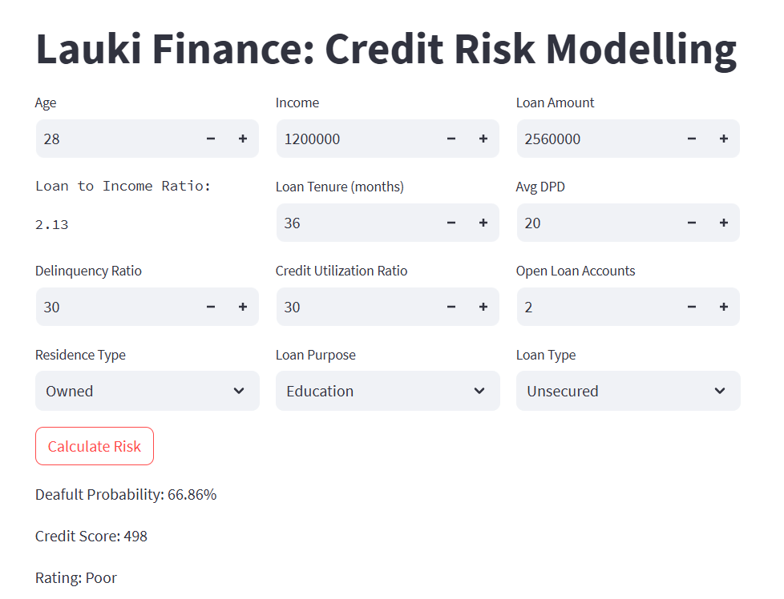

<p align="center">
  <a href="https://nbfc-credit-risk-modelling.streamlit.app/" target="_blank">
    
  </a>
</p>

# 🏦 Credit Risk Modeling – Lauki Finance

A machine learning-based credit risk prediction system built for **Lauki Finance**, an Indian NBFC, in partnership with **AtliQ AI**. The project involves developing a predictive model to assess loan default risks and assign credit ratings using a user-friendly Streamlit application.

<p align="center">
  
</p>

## 🚀 Project Overview

The objective is to build a credit scorecard and a real-time prediction system that classifies loan applications into four categories — **Poor**, **Average**, **Good**, and **Excellent** — similar to industry-standard CIBIL scores.

This project is structured in two phases:

- **Phase 1: Model Development + App UI**
- **Phase 2: Monitoring + Operationalization (MLOps)**

## 📊 Features

- Logistic regression-based credit risk model using historical loan data
- Feature engineering and preprocessing for optimal model performance
- A Streamlit-based web application to:
  - Input applicant and loan data
  - Predict default probability
  - Output credit category (Poor/Average/Good/Excellent)
- Joblib serialization for model deployment
- Clear code structure and documentation

## 🛠 Tech Stack

- **Language**: Python 3.10
- **Libraries**: `pandas`, `numpy`, `scikit-learn`, `joblib`, `streamlit`, `matplotlib`, `seaborn`
- **Deployment**: Streamlit app for end-user accessibility

## ✅ Model Highlights

- **Model Used**: Logistic Regression  
- **Target Variable**: Default indicator  
- **Output**: Credit Score category & Default Probability  

**Scoring Bins**:
- **Poor**: < 600  
- **Average**: 600–699  
- **Good**: 700–749  
- **Excellent**: 750+

## 📦 Installation

### 1.Clone the repo
```
git clone https://github.com/lintosunny/Credit-Risk-Modelling.git
```

### 2.Create environment
```
conda create -n venv python=3.10
conda activate venv
```

### 3.Install dependencies
```
pip install -r requirements.txt
```

### 4.Run the Streamlit app
```
streamlit run app/main.py
```